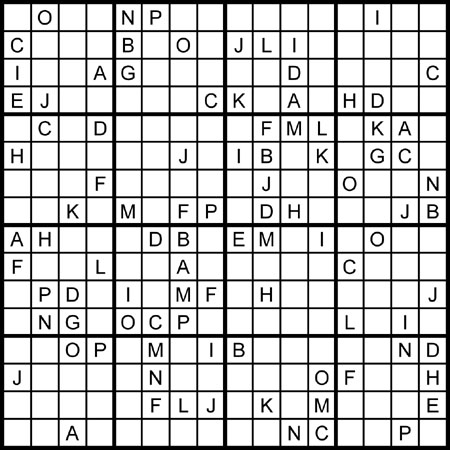

# Homework 5
## Alphahabet Sudoku Solver 15 pts
Write a solver for the 16x16 letter sudoku puzzle below. Test it with a sample starting Sudoku puzzle with some of the letters filled in. Print out a possible solution for the puzzle (make sure you use lower case letters). Submit your Prolog file along with a screen shot of your test. You may use the swipl prompt if you want, or run it as a script.

## 5 Extra Credit Points
Write it as a script that reads the starting puzzle from a text file, and outputs at least one solution to another text.

