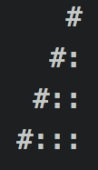

#Lab 2 - Basic Control Flow Programs
####2 pts) 1. Staircase: 
Write a function that takes in an integer and prints out a staircase to the console like this in which `n = 4`:

 

It should be able to handle any `n` up to `50`. If `n` is greater than `50`, the function should print the string `"Not available"`. 

####3 pts) 2. Divisibility 
Read the following on arrays: http://www.w3schools.com/js/js_arrays.asp. 

Write a function that takes an array of  integers, and a positive integer `n`. The function finds the number of  pairs `(i, j)` in the array where `i < j` and  `i + j`  is evenly divisible by `n`. 
Call the function with a sample array and `n`, and `console.log` the result. 
*Note*: brute force is okay.

**Sample Input**
```javascript
n = 3
[1, 3, 2, 6, 1, 2]
```
**Sample Output**`
```
 5
```
####3 pts) 3. Summing Subarray
Given an array a and an int n, find all pairs in the array that add up to n. 

Brute force is acceptable, but for 2 pts extra credit, come up with an algorithm that finds this in O(n). For the extra credit, explain, in your own words, why it works. 

####3 pts) 4. Landscape Plus
Create a landscape function as we did in class except that it has lakes (~~~), mountains (/'''\\), deserts (****), forests (YYYYYYY), and fences (XXXXXX). 

Your landscape function should take in these parameters: `function(lakeSize, mountainSize, desertSize, forestSize, fenceSize)`. 

The inner functions (see slides) should take the appropriate parameters passed into the main function. These functions should be called within the main function to produce the result string. The function should return this string. 

Make up some parameters in your script, call the function with them, and print the string to console separately. 

####Submission
Write all this in a script. Turn that script in here (you don't need to submit an html page, though you may want to make a simple one for testing). 