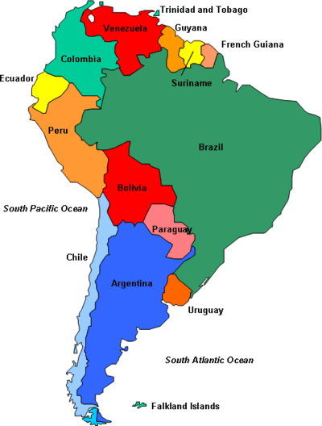

# Lab 6 - Intro to Prolog

5pts: Write a prolog script to color the map of continental (excluding islands) South America.

Image result for countries of south america

Use different colors than these, 4 colors total. No adjacent countries may have the same color.

Submit a script here, and a screenshot of you running a test query (like the map of Germany example) on your swipl. The script doesn't need to print a result --- we will talk about that later on.

Note: Use underscores for countries with two words in their names.
