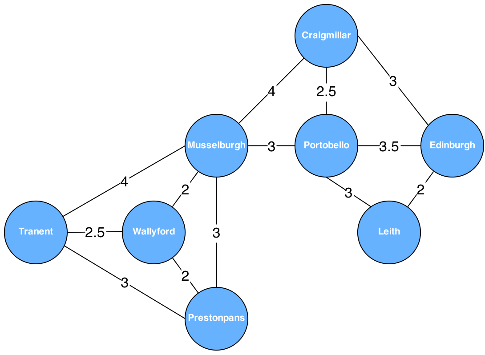

# Lab 6 - Prolog Lists
Part 1: (3pts) Do the exercise on http://www.doc.gold.ac.uk/~mas02gw/prolog_tutorial/prologpages/vars.html, to answer the following questions:

Do these terms unify? After each that unifies, write which three of the rules covered in class were applied, and in which order.

Write your answers in comments at the top of the pl file you will submit.

    eats(fred,tomatoes)
    eats(Whom,What)
    eats(fred,Food)
    eats(Person,jim)
    cd(29,beatles,sgt_pepper).
    cd(A,B,help).

Part 2: (3pts) Write a recursive predicate to count upwards, with a step of 2, from X to Y. (Assume X is less than Y).

Part 3: (3pts) Consider the graph below:

Using the on_route example here http://www.doc.gold.ac.uk/~mas02gw/prolog_tutorial/prologpages/recursion.html, write move predicates to represent the above map. Test it by navigating from Prestopans to Leith, Wallyford to Tranent, and Portobello to Musselburgh. (make sure you don't capitalize your cities like the graph does).

Part 4: (3pts.) Write a set of predicates to print every even-indexed (without accessing indices) element in a list.

Submit your prolog file, and a screen shot of your tests for Part 3.
